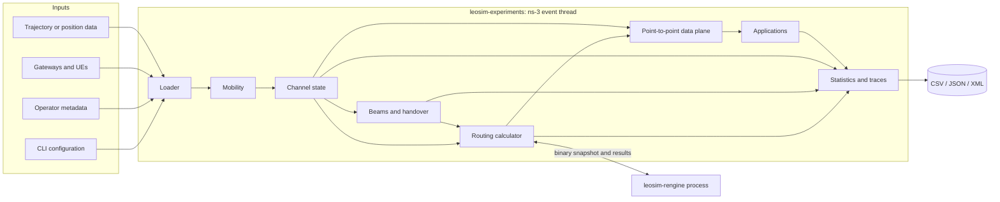
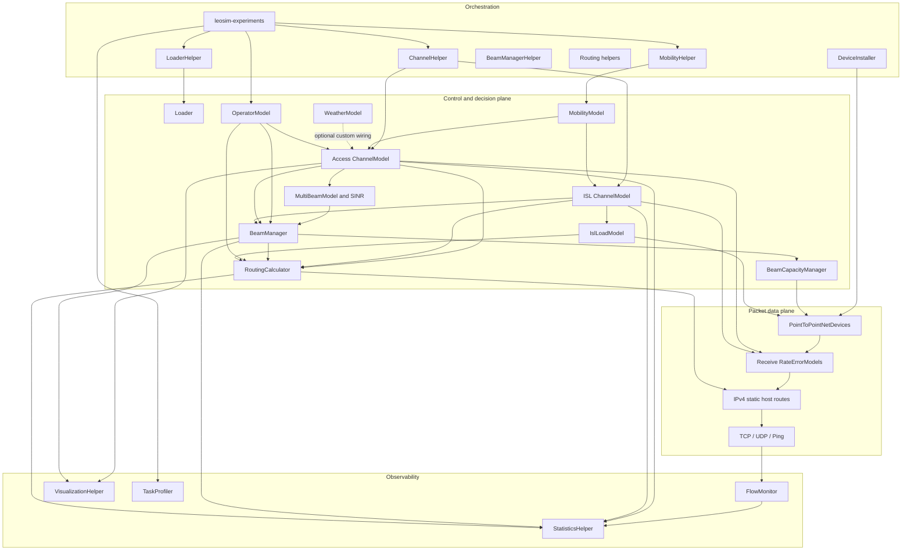

# LeoSim architecture

This document describes the architecture of the active LeoSim ns-3 module: its
runtime boundaries, data flow, link and routing semantics, major components,
extension points, operational workflow, and known limitations.

The primary source of truth is the module build definition in
[`CMakeLists.txt`](../CMakeLists.txt) and the supported scenario in
[`examples/leosim-experiments.cc`](../examples/leosim-experiments.cc).
Command-line options evolve with the scenario, so use `--PrintHelp` for the
complete current option list.

## Contents

- [System at a glance](#system-at-a-glance)
- [Architectural invariants](#architectural-invariants)
- [Repository and build boundaries](#repository-and-build-boundaries)
- [Runtime architecture](#runtime-architecture)
- [Domain model and identifiers](#domain-model-and-identifiers)
- [Simulation lifecycle](#simulation-lifecycle)
- [Subsystems](#subsystems)
- [Routing architecture](#routing-architecture)
- [Configuration and input data](#configuration-and-input-data)
- [Outputs and observability](#outputs-and-observability)
- [Build, run, and test](#build-run-and-test)
- [Extension guide](#extension-guide)
- [Performance and reproducibility](#performance-and-reproducibility)
- [Failure handling and diagnosis](#failure-handling-and-diagnosis)
- [Current boundaries and limitations](#current-boundaries-and-limitations)
- [Glossary](#glossary)

## System at a glance

LeoSim is an ns-3 module for packet-level experiments over time-varying
low-Earth-orbit satellite networks. It combines:

- trajectory-driven satellite and fixed ground-node mobility;
- satellite-to-ground access links and inter-satellite links (ISLs);
- point-to-point packet devices with dynamic availability and propagation delay;
- multi-beam footprints, SINR, beam assignment, BHO, and predictive CHO;
- operator ownership and cross-operator sharing policy;
- finite beam, satellite, service-package, and synthetic ISL capacity;
- dynamic shortest-path routing, either in process or through a standalone
  parallel destination-tree engine;
- TCP, UDP, UE-to-UE ping, and UE-to-serving-satellite ping workloads; and
- FlowMonitor, application-goodput, handover, route, link, capacity, and
  visualization outputs.

Two executables form the supported runtime:

| Runtime | Responsibility | Concurrency model |
|---|---|---|
| [`leosim-experiments`](../examples/leosim-experiments.cc) | Creates the scenario and owns every ns-3 object and event | ns-3's single simulator thread |
| [`leosim-rengine`](../utils/rengine/leosim-rengine.cc) | Computes shortest paths from serialized graph snapshots | Separate process with a C++ worker-thread pool |

The external engine is an acceleration boundary, not a second simulator. It
never receives ns-3 objects. The simulator exports a graph, invokes the engine
synchronously, imports the next hops, and then continues processing events.



## Architectural invariants

These rules explain most of LeoSim's control flow and should be preserved by
new components.

### A link exists at several different layers

A satellite-ground pair can be known to one layer and unavailable to another:

| Layer | Question | Owner |
|---|---|---|
| Candidate topology | Was this pair provisioned before the run? | [`LeoSimChannelHelper`](../helper/leosim-channel-helper.h) |
| Physical channel | Is it visible and usable now? | [`LeoSimChannelModel`](../model/leosim-channel-model.h) |
| Access authority | Is this the serving, prepared, or policy-admitted beam? | [`LeoSimBeamManager`](../model/leosim-beam-manager.h) and routing access policy |
| Routing topology | May the current route solver use the directed edge? | [`LeoSimRoutingCalculator`](../model/leosim-routing-calculator.h) |
| Forwarding state | Is an IPv4 host route installed for this destination? | routing helpers and ns-3 `Ipv4StaticRouting` |
| Packet data plane | Does the device pass the frame at the allocated rate and delay? | [`LeoSimDeviceInstaller`](../helper/leosim-device-installer.h) |

Consequently, physical visibility alone does not make an access link routable.
The normal packet path is:

```text
pre-provisioned interface
  -> physical link is UP or DEGRADED
  -> beam/access policy authorizes the edge
  -> routing installs a /32 next hop
  -> error model, queue, rate, and propagation delay deliver the packet
```

ISLs follow the same pipeline except that they do not require ground-beam
authorization.

### Topology is provisioned before simulation time advances

Point-to-point devices and IPv4 addresses are normally created during scenario
initialization. Access candidates are therefore the union of useful satellites
sampled across the planned trajectory, not only the satellites visible at time
zero. Bounded ISL candidates are also provisioned up front. Runtime events
change link gates, selected ISLs, beam authority, rates, delays, and routes
rather than routinely creating new interfaces.

### ns-3 ownership stays on one thread

Only the simulator thread reads or mutates ns-3 nodes, devices, mobility
objects, or routing tables. The route engine consumes immutable binary arrays
and produces value records. Its worker threads do not share simulator state.

### Identifiers are not interchangeable

Loader dataset IDs and ns-3 `Node::GetId()` values serve different purposes.
The mobility model retains the dataset ID for trajectory, name, and operator
lookups. Runtime link maps, callbacks, routes, and most output records use ns-3
node IDs. Code crossing that boundary must perform an explicit mapping.

### Reactive changes propagate through callbacks

Dynamic ISL reselection and serving-access changes request route refreshes.
Refresh requests at the same simulation time are coalesced. Capacity managers
then alter data rates without changing the route graph, while link-state error
models enforce hard packet availability.

## Repository and build boundaries

| Path | Role |
|---|---|
| [`CMakeLists.txt`](../CMakeLists.txt) | Defines the active `libleosim` sources, public headers, dependencies, and test suites |
| [`examples/`](../examples/) | Supported example driver and usage notes |
| [`model/`](../model/) | Stateful simulation models and core algorithms |
| [`helper/`](../helper/) | Scenario composition, device installation, route installation, and output integration |
| [`test/`](../test/) | The `leosim` and `leosim-statistics` ns-3 unit suites |
| [`ns3/datasets/leosim/`](../../../datasets/leosim/) | Small operator, ground-node, sharing, TLE, and weather inputs used by examples |
| [`utils/rengine/`](../utils/rengine/) | Standalone sparse-graph routing engine and shared binary ABI |
| [`scripts/leosim-data/tle_to_positions.py`](../../../scripts/leosim-data/tle_to_positions.py) | TLE/OMM preprocessing into LeoSim trajectory formats |
| [`experiments/leosim/visualization/visualize_3d.py`](../../../../experiments/leosim/visualization/visualize_3d.py) | Plotly-based visualization of emitted CSV traces |
| [`experiments/leosim/infrastructure/sonic/`](../../../../experiments/leosim/infrastructure/sonic/) | UCD Sonic/Apptainer/Slurm deployment examples |

The library links the ns-3 core, network, internet, internet-apps,
applications, mobility, propagation, flow-monitor, point-to-point, and
point-to-point-layout modules. The route engine is intentionally not linked to
ns-3 and is built separately.

Three similarly named source areas deserve special attention:

- [`model/leosim-channel.cc`](../model/leosim-channel.cc) preserves an older
  channel interface but its `Send` implementation is a non-forwarding stub.
  Production traffic uses standard ns-3 point-to-point channels installed by
  `LeoSimDeviceInstaller`.
- [`helper/leosim-helper.h`](../helper/leosim-helper.h) is an empty umbrella
  placeholder. Scenarios should use the specialized helpers directly.
- [`model/leosim-isl-routing-model.h`](../model/leosim-isl-routing-model.h)
  is legacy code and is excluded from the current CMake build. Active routing
  lives in `LeoSimRoutingCalculator` and its helpers.

The public umbrella header [`model/leosim.h`](../model/leosim.h) exposes most
models, but scenario composition still requires the relevant helper headers.

## Runtime architecture



The models describe current state and policy. Helpers bind those models to
concrete ns-3 nodes, devices, applications, schedules, and files. The example
is the composition root: library models do not silently construct the whole
scenario.

## Domain model and identifiers

### Nodes

LeoSim uses three logical roles:

| Role | Mobility | Typical network role |
|---|---|---|
| Satellite | Time-indexed ECEF waypoints with interpolation | Access endpoint and ISL router |
| Server/GSS | Fixed geodetic position converted to ECEF | Gateway, server, or traffic sink |
| UE | Fixed geodetic position in the current scenario | User endpoint and handover subject |

[`LeoSimMobilityModel`](../model/leosim-mobility-model.h) stores the logical
role, source dataset ID, name, waypoints, current position, and optional
velocity. Satellite position is interpolated between samples. Ground nodes are
installed with fixed positions, although their participation can be activated
later by the beam manager.

### Links

`LeoSimChannelModel` represents two link types:

- `LEOSIM_LINK_SATELLITE_TO_GROUND` for satellite-to-server and
  satellite-to-UE access; and
- `LEOSIM_LINK_ISL` for satellite-to-satellite connectivity.

Each candidate has a `LeoSimChannelQuality` snapshot containing distance,
free-space/path loss, elevation, received signal strength, SNR, Doppler,
predicted remaining ISL contact time, weather attenuation, state, type, peer
node ID, and update time.

The physical states are `UP`, `DEGRADED`, and `DOWN`. Current channel
classification uses range/elevation feasibility and SNR thresholds: above
10 dB is `UP`, above 0 dB is `DEGRADED`, and 0 dB or below is `DOWN`.
Weather can further reduce SNR and force degradation when a weather model is
attached.

The link budget uses distance and carrier frequency for free-space loss,
applies configured transmit power and antenna gains, and derives noise from
`kTB`. ISLs additionally derive signed radial Doppler and predict the time at
which relative motion will cross the maximum range.

### Operators

[`LeoSimOperatorModel`](../model/leosim-operator-model.h) maps ns-3 node IDs
to operator IDs and roles. A symmetric sharing policy provides separate
downlink, uplink, and ISL alpha factors between operators:

- alpha 1 permits full sharing;
- alpha between 0 and 1 scales effective rate and route preference; and
- alpha 0 blocks the cross-operator relationship.

The model influences access-candidate filtering, device rates, and routing
cost/eligibility. Same-operator relationships use full access by default.

## Simulation lifecycle

The main scenario performs these phases in order:

1. Define, parse, and validate command-line options. Set the ns-3 seed and run
   number, derive the optional unique output suffix, and acquire the output
   prefix lock.
2. Load satellite trajectories and ground records. Optionally restrict
   satellites by a selection file and select balanced ground-node subsets per
   operator.
3. Create satellite, server, and UE `NodeContainer` objects.
4. Install and start satellite waypoint mobility and fixed ground mobility.
5. Infer satellite ownership from the TLE catalog, register all selected nodes,
   and build the operator model.
6. Construct trajectory-aware access candidates and either a bounded
   nearest-neighbor or full-mesh ISL candidate model.
7. Install one point-to-point device pair for each provisioned candidate. Attach
   link-state receive gates, configure operator-aware rates, and optionally
   schedule geometry-derived propagation-delay refreshes.
8. Optionally construct deterministic directed synthetic ISL load, apply
   residual rates to ISL devices, and expose its route cost.
9. Install the Internet stack and assign a distinct `/30` subnet per link.
   Access allocation begins at `10.0.0.0/30`; ISL allocation begins at
   `10.128.0.0/30`.
10. Build the unified routing calculator and the route source/destination scope.
    Generate spot-beam layouts, create the multi-beam model, install the beam
    manager, and connect beam authority back into routing.
11. Optionally install shared beam/satellite capacity scheduling and serving-
    satellite ping.
12. Install initial routes. By default this exports reverse destination-tree
    requests to `leosim-rengine`; `--useRouteTreeCache=0` selects the
    in-process provider.
13. Connect periodic and reactive route updates to ISL and access-state changes.
14. Install traffic applications, FlowMonitor, periodic statistics,
    visualization, lifecycle logs, and progress/profile hooks.
15. Stop and run the simulator, emit final statistics and packet/route outputs,
    stop capacity scheduling, and call `Simulator::Destroy()`.

```mermaid
sequenceDiagram
    participant Main as leosim-experiments
    participant Loader
    participant Models as Mobility / Channel / Beam
    participant Devices as P2P / IPv4
    participant Router as Routing helper
    participant Engine as leosim-rengine
    participant Sim as ns-3 Simulator

    Main->>Loader: Load trajectories, nodes, operators
    Main->>Models: Install mobility and provision candidates
    Main->>Devices: Create devices, gates, and /30 addresses
    Main->>Models: Start beam and capacity control
    Main->>Router: Build eligible weighted topology
    Router->>Engine: Write graph + requests; invoke
    Engine-->>Router: Write next-hop results
    Router->>Devices: Install /32 host routes
    Main->>Sim: Run
    loop Scheduled and reactive events
        Sim->>Models: Update mobility, channel, beam, and capacity
        Models-->>Router: ISL or access topology changed
        Router->>Engine: Recompute coalesced route snapshot
        Engine-->>Router: Updated next hops
        Router->>Devices: Diff and replace changed routes
    end
    Sim-->>Main: Stop
    Main->>Main: Write summaries and destroy
```

### Recurring simulation behavior

Intervals are configurable; these are the principal main-scenario defaults and
event sources:

| Actor | Default cadence | Effect |
|---|---:|---|
| Satellite mobility | At loaded waypoints | Advances/interpolates position and velocity |
| Channel quality | Channel update interval, normally 1 s | Recomputes link budget, state, Doppler, and lifetime |
| Dynamic ISL selection | Configured ISL selection interval | Chooses a degree-limited connected subset and signals topology changes |
| Beam manager | 1,000 ms | Scans candidates, updates association, CHO/BHO, and beam state |
| Capacity manager | 100 ms | Reallocates directional beam/satellite capacity and device rates |
| Geometry delay | 1 s | Rewrites point-to-point propagation delays from distance |
| Dynamic routing | 30 s plus reactive callbacks | Rebuilds eligible topology and installs changed routes |
| Statistics | 1 s | Writes a cumulative/interval snapshot |
| Visualization | 1 s when enabled | Writes position and link snapshots |
| Progress logger | 5 s | Reports simulated-time versus wall-clock progress |

Events sharing a timestamp execute in ns-3 event order. Reactive route requests
use zero-delay coalescing in the main scenario, so consumers should not rely on
an arbitrary wall-clock quiet period.

Dynamic UE introduction does not create topology late. All selected UE nodes,
devices, and candidate interfaces exist during initialization; the beam manager
keeps later UEs dormant until their activation time. Applications start at the
later of their configured start and UE activation, and flows that would begin
after the application stop are skipped.

## Subsystems

### Loading and preprocessing

[`LeoSimLoader`](../model/leosim-loader.h) owns parsed satellite samples,
satellite names, ground-device records, and operator assignments. It supports
Cartesian and geodetic conversion, position lookup at arbitrary simulation
times, and interpolation/extrapolation of loaded samples.

[`LeoSimLoaderHelper`](../helper/leosim-loader-helper.h) exposes the common
scenario workflow: load records, create node containers, apply positions, and
hand the loader to mobility and operator helpers.

[`scripts/leosim-data/tle_to_positions.py`](../../../scripts/leosim-data/tle_to_positions.py) preprocesses
CelesTrak GP/OMM CSV or classic three-line TLE catalogs into trajectory CSV or
ns-2 Tcl plus a satellite-name sidecar. It depends on NumPy and Skyfield and
supports duration, timestep, worker, coordinate, and output-format controls.

### Mobility

[`LeoSimMobilityHelper`](../helper/leosim-mobility-helper.h) translates loader
samples into `LeoSimMobilityModel` waypoints and installs satellite, gateway,
and UE roles. `StartAll()` schedules waypoint processing. Between samples,
the mobility model provides interpolated positions so channel, beam, delay,
Doppler, and route calculations observe a continuous trajectory.

### Channel and candidate selection

[`LeoSimChannelHelper`](../helper/leosim-channel-helper.h) builds and
configures `LeoSimChannelModel` instances.

For access, it samples the planning horizon, selects at most
`maxAccessSatellites` feasible/nearest satellites at each epoch, and
provisions the union. If trajectory planning produces no feasible pair for a
ground node, it falls back to nearest candidates at the initial epoch.

For ISLs, the normal scalable path constructs a bounded candidate pool using
sampled trajectories and a spatial grid. At runtime the channel model:

1. filters physically feasible candidates;
2. sorts candidates by distance;
3. performs a connectivity-first, degree-constrained spanning-forest pass; and
4. fills remaining degree capacity with the shortest edges.

The alternative full mesh creates all satellite pairs and therefore has
quadratic link, device, and address growth. It is useful only for deliberately
small experiments.

### Packet devices, availability, rate, and delay

[`LeoSimDeviceInstaller`](../helper/leosim-device-installer.h) creates standard
ns-3 `PointToPointNetDevice` pairs. Each pair is retained for the life of the
normal scenario.

Receive-side `RateErrorModel` objects mirror channel state:

- `DOWN`: error rate 1, so every received frame is dropped;
- `UP` or `DEGRADED`: error rate 0, so frames pass.

`DEGRADED` therefore remains routable and does not itself introduce a random
packet-error probability. Quality-aware routing may still make it unattractive.

Delay can be constant or geometry-derived. Geometry mode periodically sets the
point-to-point channel delay to current endpoint distance divided by configured
propagation speed.

Several policies may update device data rates:

- base access or ISL rate;
- cross-operator sharing alpha;
- residual capacity after synthetic ISL background load; and
- current shared beam, satellite, and UE-package allocation.

These controls must agree about direction. The access installer applies the
conservative sharing factor to a point-to-point pair; the beam capacity manager
then manages directional allocations for associated ground nodes.

### Beam geometry and SINR

[`LeoSimBeamLayoutEngine`](../model/leosim-beam-layout-engine.h) generates
hexagonal spot-beam layouts. The current tested layouts include 19 beams for
two rings and 61 beams for three rings. Reuse colors constrain co-channel beam
activation.

[`LeoSimMultiBeamModel`](../model/leosim-multi-beam-model.h) owns the beams
for each satellite, footprint geometry, activation, phased-array configuration,
gain, and steering.

[`LeoSimSinrEngine`](../model/leosim-sinr-engine.h) combines desired signal,
intra-satellite and inter-satellite co-channel interference, antenna behavior,
and thermal noise. Beam manager candidate records use these results alongside
channel measurements.

[`LeoSimBeamHoppingManager`](../model/leosim-beam-hopping-manager.h) produces
demand-weighted time slots subject to reuse-color constraints.
[`LeoSimBeamLoadBalancer`](../model/leosim-beam-load-balancer.h) records and
compares load across candidate beams.

### Beam association and handover

`LeoSimBeamManager` is the logical authority for satellite-ground access.
For each managed ground node it stores the serving beam, ranked candidates,
timers, activation state, buffered packets, and handover history.

Candidate discovery applies hard feasibility filters and then TOPSIS ranking
over radio and policy/path criteria including RSRP, beam SINR, elevation,
time-to-exit, load, latency, operator compatibility, weather quality, and beam
activity. The main scenario supports:

- BHO, a reactive best-candidate execution path; and
- CHO, which prepares candidates before evaluating and executing a condition.

The principal beam states are:

```text
SEARCHING -> CONNECTED -> MEASURING
CHO: MEASURING -> PREPARING -> EVALUATING -> EXECUTING -> CONNECTED
BHO: MEASURING -> EXECUTING -> CONNECTED
radio/link failure -> SEARCHING -> recovery association
```

The manager implements A3/A4 criteria, time-to-trigger, T310 with N310/N311
indications, predictive time-to-exit, radio-link failure, beam-dark and
weather/load triggers, intra-satellite beam changes, inter-satellite handover,
and initial/recovery association. A serving-access change invalidates the
routing calculator's topology and requests a route refresh.

The custom [`LeoSimTcpTrafficApplication`](../model/leosim-tcp-traffic-application.h)
offers packets to the manager during execution. With buffering enabled, the
manager retains the original connected socket and flushes queued packets after
handover. UDP traffic is not hidden by that mechanism and exposes interruption
loss directly.

### Shared beam capacity

[`LeoSimBeamCapacityManager`](../model/leosim-beam-capacity-manager.h) treats
capacity as a finite hierarchical resource:

```text
satellite directional budget
  -> beam directional budget
  -> active associated UEs
  -> service-profile peak/minimum/weight
  -> point-to-point device rate
```

It supports equal, proportional-fair, and alpha-fair scheduling. Demand-aware
mode observes device transmit traces and queue pressure, considers a direction
active for a configurable timeout, and avoids allocating idle users. The
manager emits per-user allocations and the limiting reason, such as beam or
satellite capacity.

This capacity allocation is distinct from the handover load-balancing score:
one changes packet service rates, while the other changes association
preference.

### Synthetic ISL load

[`LeoSimIslLoadModel`](../model/leosim-isl-load-model.h) generates
deterministic load for each directed ISL. It is an analytical background model,
not a set of background packet applications.

Requested background traffic is admitted against both physical link capacity
and the source satellite's aggregate outgoing ISL budget. The model records
admitted and dropped background load, derives residual capacity, applies that
capacity to the corresponding point-to-point direction, and exposes reciprocal
residual capacity as a routing cost. Directional records mean A-to-B and B-to-A
may differ.

### Operator and weather policy

The main executable registers operator ownership but does not currently load
the bundled sharing matrix. Custom scenarios can call
`LeoSimOperatorHelper::LoadSharingMatrix()` before building the model.

[`LeoSimWeatherModel`](../model/leosim-weather-model.h) and
[`LeoSimWeatherHelper`](../helper/leosim-weather-helper.h) support trace,
uniform, and four-state Markov weather with rain, cloud, gaseous, and
scintillation attenuation. A custom scenario must attach the installed weather
model to the access channel and beam manager for link budget, route cost, and
handover decisions. The main `leosim-experiments` executable does not expose
or wire weather configuration today.

### Traffic

The example can install:

- all-to-all TCP from every selected UE to every selected server/GSS;
- a bounded single-scenario UDP exchange when all-to-all mode is disabled;
- disjoint UE-to-UE ICMP pairs; and
- one ping application per selected UE targeting its current serving
  satellite, with target rollover after association changes and optional load
  ramping.

The custom TCP application performs rate-controlled writes and retries
transient connection failures. Packet sinks provide exact payload byte counts.
FlowMonitor independently observes IP/transport flows.

## Routing architecture

### Topology and access policy

[`LeoSimRoutingCalculator`](../model/leosim-routing-calculator.h) is the
authoritative graph builder and edge-cost provider for both route solvers. It
merges current access and ISL snapshots, includes `UP` and `DEGRADED`
physical links, applies the selected ground-node scope, enforces operator
policy, and asks the beam manager which access links are authorized.

Its access policies are:

| Policy | Ground edges admitted |
|---|---|
| `SERVING_ONLY` | Only the current serving satellite/beam; this is the default |
| `SERVING_AND_CHO` | Serving access plus prepared CHO candidates |
| `MULTI_CONNECTIVITY` | Serving access plus the configured top-N valid candidates |

The calculator caches the assembled topology briefly and invalidates it on
relevant control-plane changes.

### Metrics

Both route paths support the scenario's metric names:

| CLI metric | Edge cost intent |
|---|---|
| `hop` | Constant cost 1 |
| `distance` | Current path distance |
| `path-loss` | Current path loss |
| `snr` | Reciprocal usable SNR |
| `signal-strength` | Negative received signal strength |
| `lifetime` | Reciprocal predicted remaining ISL contact time; neutral on access links |
| `load` | Reciprocal effective ISL capacity after synthetic load |
| `combined` | Normalized adaptive load-distance-stability routing cost |

The combined/ALDSR metric normalizes load, distance, remaining lifetime, SNR
margin, and hop penalty, then applies configured non-negative weights. It can
hard-reject edges below minimum SNR or predicted lifetime. A custom scenario
can replace edge cost through `SetEdgeCostCallback()`.

Operator policy can block an edge or multiply its cost after the physical
metric is computed.

### Default external destination-tree path

The main scenario defaults to `--useRouteTreeCache=1`.
[`LeoSimExternalRoutingHelper`](../helper/leosim-external-routing-helper.h)
performs the integration:

1. Ask the calculator for the current allowed, weighted directed graph.
2. Map sparse ns-3 node IDs to dense routing-engine IDs.
3. Write a versioned CSR graph and route-request file.
4. Invoke `leosim-rengine` with a blocking `std::system` call.
5. Validate result magic, version, and snapshot ID.
6. Map dense next hops back to ns-3 nodes, interfaces, and gateway addresses.
7. Diff against the prior result and install changed `/32` static host routes.

The binary contract is defined in
[`utils/rengine/rengine-format.h`](../utils/rengine/rengine-format.h).
Snapshots are written as `snapshot-N.graph`, `.requests`, and `.results`
in the configured working directory.

Destination-tree mode groups requests by destination. The engine builds the
reverse graph once, then schedules reverse BFS for hop count or reverse
Dijkstra for weighted metrics across worker threads. This changes route
calculation from repeated source-destination searches to approximately one
tree per traffic destination. The result returns the next hop, total cost, hop
count, and validity; ns-3 remains responsible for actual route installation.

Because invocation is synchronous, the worker pool reduces wall-clock route
calculation time but simulation events do not advance while a snapshot is
being solved.

### In-process path and provider seam

With `--useRouteTreeCache=0`,
[`LeoSimRoutingCalculatorHelper`](../helper/leosim-routing-calculator-helper.h)
uses the built-in [`LeoSimDijkstraRoutingModel`](../model/leosim-routing-calculator.h)
and installs the same style of static host routes.

`LeoSimRouteProvider` is the algorithm extension seam. Implement
`ComputeRoute(const LeoSimRoutingRequest&, const LeoSimRoutingContext&)` and
pass the provider to `LeoSimRoutingCalculator::SetRouteProvider()` to replace
Dijkstra without changing topology construction.

### Route refresh

Routes can be static or periodically recomputed. The main scenario also
requests reactive refresh when:

- the active degree-limited ISL set changes; or
- the beam manager changes authorized serving access.

Requests produced within the same event batch are debounced/coalesced. Route
updates operate on a fresh topology snapshot and replace only changed next-hop
entries.

## Configuration and input data

Run `leosim-experiments --PrintHelp` for the complete set of flags. The
configuration groups below reflect the current composition:

| Group | Representative controls |
|---|---|
| Dataset and scale | trajectory path/format, data directory, satellite selection, satellite/server/UE counts, per-operator balancing |
| Access | elevation, maximum range, base rate/delay, candidate bound and planning sample interval |
| ISL | enabled/full-mesh mode, neighbor degree, range, frequency, power, gain, rate, delay |
| Capacity/load | beam/satellite/package rates, scheduler, alpha, demand tracking, synthetic load distribution/seed |
| Routing | periodic/static mode, interval, metric, ALDSR weights/bounds, external engine/work directory/workers/request cap |
| Beams/handover | rings, radius, reuse, BHO/CHO, candidates, buffering, A3/A4, TTT, T310/N310/N311, TTE, preparation/execution delay |
| Traffic | endpoints, TCP/UDP rates and sizes, all-to-all mode, UE and serving-satellite pings |
| Lifecycle | initial UEs, activation start/interval/batch size |
| Output | prefix/suffix behavior, FlowMonitor, statistics, route/handover/capacity logs, visualization, profiling |
| Reproducibility | ns-3 RNG seed and independent run number |

### Input formats

| Input | Format and semantics |
|---|---|
| Satellite ns-2 trace | `$ns_ at TIME "$node_(ID) set X_/Y_/Z_ VALUE"`; the Z line commits one Cartesian sample |
| Satellite Cartesian CSV | `sat_id,sat_name,timestep,time_s,x_m,y_m,z_m` |
| Satellite geodetic CSV | `sat_id,sat_name,timestep,time_s,latitude_deg,longitude_deg,altitude_m`; detected from the header |
| Optional trace sidecar | `<trace>.names.csv` with at least `sat_id,sat_name` |
| Data-directory ground nodes | `data/gss/<operator>.txt` and `data/ues/<operator>.txt`, rows `name,latitude_deg,longitude_deg[,altitude_m]` |
| Legacy ground CSV | Header aliases for ID, name, type, geodetic or Cartesian coordinates, plus optional operator |
| TLE/OMM operator catalog | `data/tles/<operator>.csv` or `.txt`; filename stem is the operator |
| Satellite selection | First CSV column contains original satellite dataset IDs; comments/header are ignored |
| UE service profiles | `node_id,dl_peak,dl_min,ul_peak,ul_min,weight` |
| Sharing matrix | `OperatorA,OperatorB,AlphaDL,AlphaUL,AlphaISL` |
| Weather Markov matrix | Four state rows for clear, cloudy, light rain, and heavy rain |

TLE catalogs in the main scenario provide operator mapping, not live orbit
propagation. The loader lexically scans catalog files, counts valid satellites,
and associates sequential trajectory IDs with each filename stem.
Preprocessing must therefore preserve the same catalog order.

The default trajectory path is
`../datasets/leosim/generated/default/prepro/satellite_mobility.tcl`, but generated
preprocessed files may not be present in a fresh checkout. Generate them before
running, or pass a Cartesian/geodetic CSV with `--useTrace=0`.

### Important default behavior

The scenario defaults are aimed at a bounded, route-cached experiment:

- up to 500 satellites, all loaded servers and UEs, and 200 seconds;
- bounded access candidates and degree-4 nearest-neighbor ISLs;
- geometry-derived access delay and dynamic routing every 30 seconds;
- external reverse destination-tree routing with eight engine workers;
- shared alpha-fair beam capacity and deterministic synthetic ISL load;
- all-to-all TCP data traffic;
- CHO with three prepared candidates and handover buffering; and
- FlowMonitor, statistics, task profiling, and handover logging enabled.

`--uniqueOutputPrefix=1` is also the default. It appends handover mode,
seed/run, job identity when available, timestamp, and PID. Use
`--uniqueOutputPrefix=0` only when the caller guarantees that concurrent runs
cannot share the same prefix.

## Outputs and observability

For an effective prefix `RUN`, the main scenario may create:

| File | Enabled by | Purpose |
|---|---|---|
| `RUN-statistics.csv` | statistics | Periodic cumulative and interval network/application metrics |
| `RUN-statistics.json` | statistics | Final structured summary with schema `leosim.statistics.v1` |
| `RUN-flowmon.xml` | FlowMonitor output | Per-flow IP/transport counters, delay, jitter, and loss |
| `RUN-handovers.csv` | handover logging | Handover trigger, state, outcome, duration, and serving changes |
| `RUN-cho-candidates.csv` | handover logging | Ranked/prepared CHO candidate records |
| `RUN-routes.csv` | route logging | Selected paths and path-specific metrics |
| `RUN-isl-load.csv` | synthetic-load logging | Directed requested/admitted/dropped load, residual capacity, and route cost |
| `RUN-beam-capacity.csv` | capacity logging | Per-user directional allocations, queues, caps, scheduler, and limit reason |
| `RUN-ground-node-lifecycle.csv` | dynamic lifecycle logging | Active/inactive ground-node counts over time |
| `RUN-satellite-ping.csv` | serving-satellite ping | Per-UE totals, target changes, delivery, and RTT |
| `RUN-satellite-ping-timeseries.csv` | serving-satellite ping | One-second aggregate ping load, delivery, and RTT |
| `RUN-positions.csv` | visualization | Time-indexed node positions |
| `RUN-links.csv` | visualization | Unified access/ISL physical and logical link state |
| `RUN-packets.csv` | visualization | Packet events consumed by the 3D visualizer |
| `RUN.lock` | every main run | Non-blocking collision guard for the output prefix |

The prefix lock prevents simultaneous writers but the lock file is retained
after release. External routing snapshots also remain in the configured route
working directory unless the caller cleans them.

### Measurement layers

LeoSim deliberately exposes two throughput notions:

- FlowMonitor throughput uses received IP bytes and observed flow duration.
- Application goodput uses exact payload bytes received by registered
  `PacketSink` objects over the configured application measurement window.

The periodic statistics CSV includes cumulative application bytes/goodput and
interval goodput for outage analysis. The final JSON also includes sink
minimum/mean/maximum goodput and Jain fairness. These figures should not be
treated as interchangeable with link capacity or offered load.

[`LeoSimStatisticsHelper`](../helper/leosim-statistics-helper.h) can attach to
FlowMonitor, packet sinks, access and ISL channels, beam management, routing,
and synthetic load. [`LeoSimVisualizationHelper`](../helper/leosim-visualization-helper.h)
provides broader trace schemas for positions, links, packets, beams, CHO,
handover, operators, sharing, weather, attenuation, and coverage; the main
scenario enables only the subset listed above.

## Build, run, and test

Run ns-3 commands from the enclosing `ns3/` directory.

### Configure and build

```bash
./ns3 configure --enable-examples --enable-tests
CCACHE_DISABLE=1 ./ns3 build leosim-experiments
make -C contrib/leosim/utils/rengine
```

The current ns-3 checkout is version 3.45 and its module build uses C++20. The
standalone route engine uses C++17 and pthreads.

The separate route-engine build is required when
`--useRouteTreeCache=1`. A run may instead select the in-process solver with
`--useRouteTreeCache=0`.

### Inspect and run

```bash
./ns3 run "leosim-experiments --PrintHelp" --no-build

./ns3 run "leosim-experiments \
  --simTime=300 \
  --numSatellites=500 \
  --routingMetric=combined \
  --outputPrefix=results/leosim"
```

Set both seed and run for reproducible independent replications:

```bash
./ns3 run "leosim-experiments \
  --rngSeed=20260803 \
  --rngRun=1 \
  --simTime=300 \
  --outputPrefix=results/run-1"
```

See [`examples/README.md`](../examples/README.md) for focused routing and
handover examples.

### Tests

```bash
./ns3 run "test-runner --suite=leosim --verbose" --no-build
./ns3 run "test-runner --suite=leosim-statistics --verbose" --no-build
contrib/leosim/utils/rengine/leosim-rengine --self-test
```

The `leosim` suite covers bounded and dynamic ISLs, trajectory-aware access
candidates, delay modes, beam layouts, SINR, antenna gain, beam hopping,
handover paths, operator sharing, routing authority and metrics, weather,
synthetic load, capacity scheduling, and dynamic UE activation. The statistics
suite covers running aggregates, snapshots, and application goodput. The route
engine self-test checks weighted and hop-count results in serial and parallel.

### Optional tooling dependencies

There is no consolidated Python lock file. Current utilities require:

- NumPy and Skyfield for trajectory preprocessing;
- Matplotlib and Pandas for analysis/plot scripts; and
- Plotly for the 3D visualizer.

The Sonic scripts are site-specific deployment examples. They assume UCD
paths, modules, scratch storage, Slurm, and Apptainer and should be adapted
before use elsewhere.

## Extension guide

| Change | Primary extension point |
|---|---|
| Add an input format | [`model/leosim-loader.*`](../model/) and [`helper/leosim-loader-helper.*`](../helper/) |
| Change movement semantics | [`LeoSimMobilityModel`](../model/leosim-mobility-model.h) and its helper |
| Add physical link metrics/state | [`LeoSimChannelModel`](../model/leosim-channel-model.h) |
| Change candidate provisioning | [`LeoSimChannelHelper`](../helper/leosim-channel-helper.h) |
| Change packet gate/rate/delay behavior | [`LeoSimDeviceInstaller`](../helper/leosim-device-installer.h) |
| Add antenna, footprint, or interference behavior | multi-beam, layout, and SINR models |
| Change association or CHO/BHO | [`LeoSimBeamManager`](../model/leosim-beam-manager.h) and helper |
| Change shared resource scheduling | [`LeoSimBeamCapacityManager`](../model/leosim-beam-capacity-manager.h) |
| Add a route metric | edge-cost callback or metric handling in `LeoSimRoutingCalculator` and external exporter |
| Add a route algorithm | implement `LeoSimRouteProvider` |
| Change scalable tree computation | external routing helper, [`rengine-format.h`](../utils/rengine/rengine-format.h), and route engine together |
| Add traffic behavior | custom application model or traffic setup in the example/helper |
| Add metrics/output | statistics or visualization helper |
| Add a supported scenario option | [`examples/leosim-experiments.cc`](../examples/leosim-experiments.cc) |

When changing the external binary format, update the exporter, engine, importer,
magic/version checks, and self-tests as one compatibility unit.

When adding a link-affecting policy, decide explicitly which layer it changes:
physical state, access authority, routing cost/eligibility, device rate,
packet-error behavior, or some combination. Updating only one layer can create
a graph that looks correct in logs but cannot carry packets.

The beam manager exposes callbacks for handover, handover start, beam state,
CHO configuration, and access-state changes. These are stored as single
callbacks rather than multicast trace sources; installing a later callback can
replace an earlier consumer. Prefer an explicit fan-out adapter when more than
one subsystem must observe the same callback.

## Performance and reproducibility

### Scaling dimensions

| Feature | Growth/risk | Mitigation |
|---|---|---|
| Full-mesh ISLs | Quadratic pairs, devices, interfaces, and channel updates | Use bounded nearest-neighbor ISLs |
| Access candidates | Ground nodes × union of sampled candidate satellites | Bound candidates and choose a defensible planning sample interval |
| Route calculation | Graph size × source/destination requests | Use reverse destination trees and scope route endpoints |
| All-to-all TCP | UEs × servers applications and flows | Disable all-to-all or reduce endpoint sets |
| Trace output | Nodes/links/packets × samples | Increase intervals and enable only needed outputs |
| Mobility preprocessing | Satellites × trajectory steps | Generate once, reuse immutable inputs, and use scratch storage for large files |
| Synchronous route updates | Simulation wall time pauses during every engine call | Increase interval, reduce requested destinations, and tune engine workers |

The external route request cap prevents accidentally materializing an
unbounded next-hop table. Route-tree mode is most effective when many sources
share a comparatively small destination set.

Candidate sampling is an accuracy/memory tradeoff. A coarse interval can miss a
short future contact, while a fine interval can provision many interfaces that
are rarely active.

### Reproducibility checklist

- Record the exact trajectory and ground datasets, not only their directory.
- Record all CLI arguments and the effective output prefix.
- Set both `rngSeed` and `rngRun`.
- Preserve satellite-selection files and TLE catalog ordering.
- Record the route-engine binary/version and worker count.
- Keep synthetic-load seed/distribution/range with each run.
- Distinguish configured application stop from simulation stop; a longer
  default app window is truncated by a shorter simulation.
- Disable unique suffixing only for a controlled, collision-free workflow.

## Failure handling and diagnosis

The main scenario fails fast for invalid enum values, non-positive intervals,
inconsistent timer windows, invalid endpoint indices, unsafe packet sizes,
unsupported schedulers, and conflicting lifecycle/application times. Dataset
load failures may log and return zero before the main count validation.
Malformed numeric input can raise a conversion exception.

At runtime, several conditions are expected model behavior rather than process
errors: a missing route, a `DOWN` link dropping frames, a UE entering
`SEARCHING`, a handover buffer filling, or TCP retrying a transient
connection.

### Diagnostic path

When a flow cannot deliver packets, inspect the layers in this order:

1. Confirm both endpoint nodes were selected and activated.
2. Confirm the relevant candidate point-to-point devices and `/30` addresses
   were provisioned.
3. Check current access/ISL physical state, distance, elevation, and SNR.
4. For a ground edge, check current beam association, beam activity, and
   operator compatibility.
5. Check that the endpoint is in the route source/destination scope.
6. Inspect route logs or static tables for the destination `/32`.
7. Check the receive gate and effective device rate after sharing, ISL load,
   and beam capacity.
8. Check application start/stop, UE activation, socket state, and sink port.
9. Compare application goodput with FlowMonitor counters to locate the layer at
   which delivery stopped.

For external routing failures, verify that the engine exists and is executable,
the working directory is writable, request count is below the configured cap,
and graph/request/result files share the expected ABI version and snapshot ID.
The helper logs and returns failure for export, process, or import errors.

Output behavior varies by component: some telemetry paths warn and continue,
while statistics/load streams may throw and capacity/lifecycle/ping files may
abort when they cannot be opened. Treat output-directory validation as part of
experiment setup.

## Current boundaries and limitations

- `leosim-experiments` is the single supported module example and composition
  root; utility and scratch experiments may lag its current interfaces.
- Weather support is built and tested but is not wired into the main scenario.
- The bundled operator sharing matrix is not loaded by the main scenario.
- `LeoSimChannel` is a compatibility stub, not the packet transport path.
- The legacy `LeoSimIslRoutingModel` files are not in the active build.
- Runtime access/ISL dynamics normally toggle pre-provisioned candidates;
  arbitrary late link creation is not the standard path.
- A `DEGRADED` channel passes frames without a stochastic error penalty.
- External routing is process-isolated and internally parallel, but the
  simulator waits synchronously for each result.
- Route snapshots and output lock files are not automatically removed.
- Ground nodes are geographically fixed in the supported scenario even when
  their service activation is dynamic.
- Callback setters in beam management are single-subscriber and may overwrite
  prior consumers.
- Python utilities do not share a pinned dependency environment.
- There is no LeoSim-specific continuous-integration workflow in this tree;
  local unit suites and route-engine self-tests are the verification baseline.

## Glossary

| Term | Meaning in LeoSim |
|---|---|
| Access link | Satellite-to-ground candidate connecting a satellite to a UE or server/GSS |
| ALDSR | Combined adaptive load-distance-stability route metric |
| BHO | Reactive best-candidate handover path |
| Candidate | A pair provisioned with devices/addresses; not necessarily active or authorized |
| CHO | Conditional handover with candidate preparation and later execution |
| ECEF | Earth-centered, Earth-fixed Cartesian coordinate system |
| GSS | Ground station/server used as a network endpoint or gateway |
| ISL | Inter-satellite link |
| Physical state | Channel-level `UP`, `DEGRADED`, or `DOWN` result |
| Prepared access | CHO candidate that may be admitted by a non-default access policy |
| Route tree | Reverse shortest-path tree shared by many sources for one destination |
| Serving access | The satellite/beam currently authorized for a ground node |
| Synthetic ISL load | Deterministic analytical background utilization, not packet traffic |
| TOPSIS | Multi-criteria candidate ranking used by beam/handover management |
