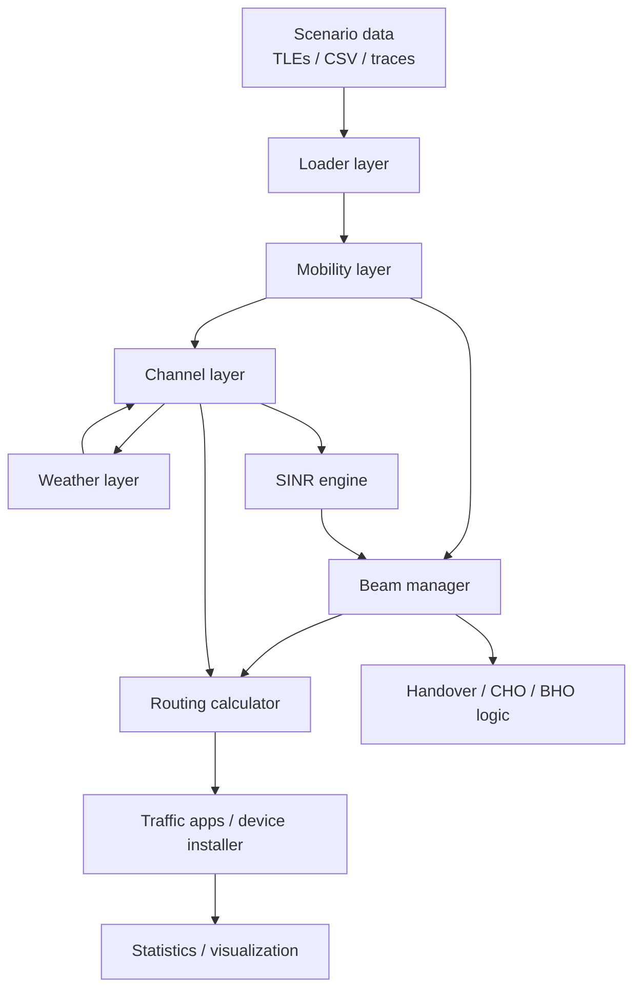
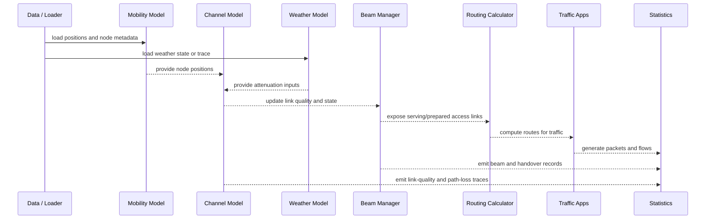
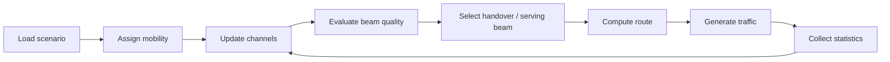

# LeoSim Architecture

## 1. Purpose and scope

LeoSim is a modular ns-3 framework for simulating LEO satellite networks with realistic mobility, beam access, propagation, routing, handover, and telemetry. It is intended for research and engineering studies of constellation behavior under dynamic topology, weather, interference, and traffic load.

In practice, LeoSim is not just a single model. It is a pipeline of cooperating subsystems:

- scenario ingestion and data loading,
- moving-node and topology generation,
- radio propagation and link quality estimation,
- satellite beam selection and handover control,
- routing over mixed ground/satellite links,
- traffic generation and application execution,
- trace collection, statistics, and visualization.

---

## 2. System-level architecture

The high-level execution path is:

```text
Input data (TLEs, mobility traces, ground devices, weather traces)
        -> Loader and helper setup
        -> Mobility model and node instantiation
        -> Channel, weather, and SINR evaluation
        -> Beam management and handover logic
        -> Routing decisions over active links
        -> Traffic generation and application traffic
        -> Statistics, traces, and visualization output
```

### 2.1 Architecture diagram



### 2.2 Runtime interaction diagram



---

## 3. Module-by-module explanation

### 3.1 Scenario and data layer

This layer converts raw scenario inputs into simulation-ready objects.

Main responsibilities:

- load satellite positions from CSV, Tcl, or preprocessed traces,
- load ground devices and gateways from text or CSV data,
- assign operator IDs to satellites and ground nodes,
- import weather traces or configure weather behavior,
- prepare node metadata used throughout the simulation.

Key classes:

- LeoSimLoader
- helper classes such as LeoSimMobilityHelper and LeoSimWeatherHelper

Typical input sources:

- data/prepro/
- data/tles/
- data/gss/
- data/ues/
- data/weather/

Why this layer matters:

The rest of the framework assumes that geometry, mobility, operators, and environmental context already exist. This layer is the bridge between external datasets and the ns-3 runtime.

---

### 3.2 Mobility and topology layer

This layer handles where each node is located at each time instant.

Main responsibilities:

- represent satellites, gateways, and UEs as ns-3 nodes,
- assign waypoints and dynamic motion to nodes,
- support stationary ground nodes and moving satellites,
- provide position and velocity data to downstream models.

Key classes:

- LeoSimMobilityModel
- LeoSimLoader

The mobility model supports a waypoint-based motion abstraction. In a LEO network, this is important because link viability, beam coverage, handover opportunity, and routing all depend directly on relative motion.

---

### 3.3 Channel and link-quality layer

This is the core radio link subsystem. It determines whether a link exists, how strong it is, and whether it is usable.

Main responsibilities:

- compute distance between nodes,
- enforce maximum link distance constraints,
- evaluate elevation angle and line-of-sight feasibility,
- estimate path loss and signal strength,
- determine link state as up/down/degraded,
- support both satellite-to-ground and inter-satellite links.

Key classes:

- LeoSimChannelModel
- LeoSimChannel
- LeoSimSinrEngine

The channel model stores a link database and updates each link periodically or on demand.

#### 3.3.1 Propagation and link budget model

The implementation uses a simplified link-budget style model. The received power is approximated as:

$$
P_r = P_t + G_t + G_r - PL
$$

where:

- $P_r$ is received power in dBm,
- $P_t$ is transmit power in dBm,
- $G_t$ and $G_r$ are transmit/receive antenna gains in dB,
- $PL$ is path loss in dB.

The free-space path loss term is implemented in the SINR engine as:

$$
FSPL = 32.44 + 20\log_{10}(d_{km}) + 20\log_{10}(f_{MHz})
$$

and therefore:

$$
P_r = EIRP + G_r - FSPL
$$

where $EIRP = P_t + G_t$.

#### 3.3.2 Link-state logic

A link is marked down when the distance exceeds the configured maximum, or when the computed quality falls below an acceptable threshold. The channel model tracks the current state and exposes it to the beam manager and routing layer.

---

### 3.4 Weather and atmospheric attenuation layer

LeoSim includes a weather-aware propagation layer for ground-to-satellite links.

Main responsibilities:

- evolve weather states for each ground node,
- model rain, cloud, gaseous absorption, and scintillation,
- provide attenuation values to the channel and beam layers.

Key classes:

- LeoSimWeatherModel

#### 3.4.1 Weather states and Markov evolution

The weather model uses a discrete-state Markov chain. Each state can transition to another state according to a probability matrix:

$$
P = \begin{bmatrix}p_{00} & p_{01} & p_{02} & p_{03} \\ p_{10} & p_{11} & p_{12} & p_{13} \\ p_{20} & p_{21} & p_{22} & p_{23} \\ p_{30} & p_{31} & p_{32} & p_{33}\end{bmatrix}
$$

where the states are:

- clear sky,
- cloudy,
- light rain,
- heavy rain.

#### 3.4.2 Rain attenuation

The rain attenuation model is based on a practical ITU-R-style approximation:

$$
A_R \approx \gamma_R \cdot L_e
$$

with the rain-specific attenuation coefficient:

$$
\gamma_R = k R^{\alpha}
$$

where $R$ is the rain rate and $k, \alpha$ are frequency-dependent coefficients.

#### 3.4.3 Cloud attenuation

Cloud attenuation is approximated as:

$$
A_C = \frac{K_l \cdot L}{\sin(\theta)}
$$

where:

- $K_l$ is the specific cloud attenuation coefficient,
- $L$ is the liquid water content,
- $\theta$ is the elevation angle.

#### 3.4.4 Gaseous attenuation

The gaseous term combines oxygen and water-vapour absorption:

$$
A_G = \frac{\gamma_o + \gamma_w}{\sin(\theta)}
$$

#### 3.4.5 Scintillation and total attenuation

The model also computes a scintillation term and combines all effects as:

$$
A_T = A_G + \sqrt{(A_R + A_C)^2 + A_S^2}
$$

where $A_S$ is the scintillation sample.

This layer is important because weather can determine whether a user remains connected to the same satellite or must hand over to a better candidate.

---

### 3.5 SINR and interference layer

The SINR engine evaluates beam-level radio performance for a UE and one or more satellites.

Main responsibilities:

- compute the received signal power of the serving beam,
- evaluate intra-satellite interference,
- evaluate inter-satellite interference,
- compute thermal noise,
- return SINR and related metrics.

Key class:

- LeoSimSinrEngine

The SINR is computed in linear form as:

$$
SINR = \frac{S}{I_{intra} + I_{inter} + N}
$$

and converted to dB as:

$$
SINR_{dB} = 10\log_{10}(SINR)
$$

The received power is based on the same path-loss style model used by the channel layer.

This subsystem is the foundation for beam ranking, handover decisions, and access-link quality evaluation.

---

### 3.6 Beam management and handover layer

This is the access-control and mobility-management core of LeoSim.

Main responsibilities:

- maintain serving beams for UEs,
- evaluate beam quality and availability,
- support beam hopping,
- manage handover triggers and candidate selection,
- support BHO and CHO-style logic,
- record beam transitions and handover outcomes.

Key classes:

- LeoSimBeamManager
- LeoSimBeamLayoutEngine
- LeoSimMultiBeamModel
- LeoSimBeamHoppingManager
- LeoSimBeamLoadBalancer

#### 3.6.1 Handover triggers

LeoSim supports several trigger styles, including:

- A3 event:

$$
RSRP_{best} > RSRP_{serving} + \Delta_{A3}
$$

- A4 event:

$$
RSRP_{best} > \theta_{A4}
$$

- elevation-based triggers,
- time-to-exit (TTE) triggers,
- weather-fade triggers,
- radio-link-failure triggers.

#### 3.6.2 TTT and T310 logic

LeoSim also implements timer-based logic similar to cellular handover mechanisms:

- TTT (time-to-trigger) delays handover until a condition persists,
- T310/N310 logic handles radio-link failure and recovery.

#### 3.6.3 TOPSIS-based beam ranking

Beam ranking uses a TOPSIS multi-criteria decision approach. The key steps are:

1. construct a decision matrix $X$ from candidate beam features,
2. normalize each criterion:

$$
r_{ij} = \frac{x_{ij}}{\sqrt{\sum_{k=1}^{m} x_{kj}^2}}
$$

3. apply weights:

$$
v_{ij} = w_j r_{ij}
$$

4. determine ideal and anti-ideal solutions $V^+$ and $V^-$,
5. compute separation distances:

$$
d_i^+ = \sqrt{\sum_j (v_{ij} - v_j^+)^2}
$$

$$
d_i^- = \sqrt{\sum_j (v_{ij} - v_j^-)^2}
$$

6. compute the TOPSIS score:

$$
C_i^* = \frac{d_i^-}{d_i^+ + d_i^-}
$$

The candidate with the highest $C_i^*$ is selected as the preferred target.

This layer is one of the most important parts of the simulator because it determines how user traffic is attached to the constellation over time.

---

### 3.7 Routing layer

The routing layer computes how traffic flows through the network graph.

Main responsibilities:

- find routes between source and destination nodes,
- support mixed satellite/ground paths,
- use hop count, path loss, SNR, distance, and signal strength as routing metrics,
- enforce operator-aware and access-link constraints,
- support access-link policies such as serving-only or multi-connectivity,
- expose routing state to user-defined routing models,
- install computed IPv4 routes through a shared helper path.

Key classes:

- LeoSimRoutingCalculator
- LeoSimRouteProvider
- LeoSimDijkstraRoutingModel
- LeoSimRoutingCalculatorHelper

Routing is implemented as a graph problem. By default, the calculator builds a graph from active links and uses `LeoSimDijkstraRoutingModel`, a Dijkstra-style route provider:

$$
\text{cost}(path) = \sum_e w(e)
$$

where $w(e)$ depends on the selected metric. Typical choices include:

- minimum hop count,
- minimum path loss,
- maximum SNR,
- minimum distance,
- maximum signal strength.

The default provider is installed automatically when a `LeoSimRoutingCalculator` is created, so existing simulations continue to use the built-in Dijkstra behavior unless the user configures something else.

#### 3.7.1 Public routing inputs

Route computation is now separated from route installation. `LeoSimRoutingCalculator` acts as an orchestrator:

1. build a `LeoSimRoutingRequest`,
2. build a `LeoSimRoutingContext`,
3. call the configured `LeoSimRouteProvider`,
4. validate the returned `LeoSimRoute`,
5. pass valid routes to helper code for IPv4 route installation.

`LeoSimRoutingRequest` contains the per-route inputs:

- source node,
- destination node,
- current simulation time,
- routing metric,
- path type constraint,
- minimum SNR constraint.

`LeoSimRoutingContext` contains the shared topology and subsystem state exposed to custom routing providers:

- ground channel model,
- ISL channel model,
- beam manager,
- operator model,
- access-link policy,
- multi-connectivity limit,
- access-authority state,
- active topology adjacency graph,
- calculator pointer for link-quality helper methods.

This makes custom routing models independent from LeoSim internals while still giving them access to the same inputs used by the default algorithm.

#### 3.7.2 Default Dijkstra routing

The default behavior is equivalent to the existing LeoSim routing path:

```cpp
Ptr<LeoSimRoutingCalculator> calculator = CreateObject<LeoSimRoutingCalculator>();
calculator->SetChannelModel(groundChannelModel);
calculator->SetIslChannelModel(islChannelModel);

LeoSimRoute route = calculator->ComputeRoute(
    source,
    destination,
    LeoSimRoutingCalculator::LEOSIM_METRIC_HOP_COUNT,
    LeoSimRoutingCalculator::LEOSIM_PATH_ANY);
```

Users do not need to explicitly create the default provider. Passing a null provider also restores the default Dijkstra provider:

```cpp
calculator->SetRouteProvider(nullptr);
```

#### 3.7.3 Custom edge-cost callback

For experiments that only need a different edge metric, users can keep the built-in Dijkstra search and replace the edge cost calculation:

```cpp
double
WeatherAwareCost(Ptr<Node> a, Ptr<Node> b, const LeoSimChannelQuality& quality)
{
    return quality.distance + 1000.0 * std::max(0.0, 10.0 - quality.snr);
}

calculator->SetEdgeCostCallback(MakeCallback(&WeatherAwareCost));
```

When the callback is configured, `LeoSimDijkstraRoutingModel` uses the callback result as the base edge cost. Existing operator-sharing and weather-attenuation penalties are still applied by the calculator after the base cost is computed.

This is useful for research metrics such as:

- congestion-aware routing,
- weather-risk-aware routing,
- handover-penalty routing,
- remaining-visibility-time routing,
- bandwidth-aware routing,
- multi-objective weighted routing.

#### 3.7.4 Custom route provider

For experiments that need a completely different path-search algorithm, users can implement `LeoSimRouteProvider`:

```cpp
class MyRoutingModel : public LeoSimRouteProvider
{
  public:
    static TypeId GetTypeId()
    {
        static TypeId tid = TypeId("ns3::MyRoutingModel")
                                .SetParent<LeoSimRouteProvider>()
                                .SetGroupName("LeoSim")
                                .AddConstructor<MyRoutingModel>();
        return tid;
    }

    LeoSimRoute ComputeRoute(const LeoSimRoutingRequest& request,
                             const LeoSimRoutingContext& context) override
    {
        LeoSimRoute route;

        // Use request.source, request.destination, request.metric,
        // request.pathType, request.minSnr, and context.topology here.
        // Fill route.path in source-to-destination order.

        route.valid = !route.path.empty();
        route.hopCount = route.path.size() > 0 ? route.path.size() - 1 : 0;
        return route;
    }
};

Ptr<MyRoutingModel> model = CreateObject<MyRoutingModel>();
calculator->SetRouteProvider(model);
```

The calculator validates returned routes before accepting them. A custom provider must return a path that starts at `request.source`, ends at `request.destination`, uses available links, satisfies the requested path type, and meets the SNR constraint when one is configured.

#### 3.7.5 Route installation

Route computation is separate from IPv4 route installation. `LeoSimRoutingCalculatorHelper` exposes reusable installation functions:

```cpp
LeoSimRoutingCalculatorHelper helper;

LeoSimRoute route = calculator->ComputeRoute(source, destination);
helper.InstallRoute(route, true);

std::vector<LeoSimRoute> routes = {route};
helper.InstallRoutes(routes, true);
```

The existing `SetStaticRoutes()` and dynamic routing update paths use the same installation logic internally. This keeps next-hop address selection and `/32` host-route installation centralized for default, custom, and externally computed routes.

This layer connects the physical and access layers to the traffic layer.

---

### 3.8 Traffic and application layer

This layer installs applications and traffic generators so the network can carry data.

Main responsibilities:

- create traffic generators for UEs and servers,
- connect nodes into realistic traffic flows,
- install Internet and application stacks,
- support large-scale workload generation.

Key helpers:

- LeoSimTrafficGeneratorHelper
- LeoSimDeviceInstaller

This layer is where abstract routing and link state translate into end-to-end packet flow.

---

### 3.9 Statistics, tracing, and visualization layer

LeoSim does not stop at simulation execution. It also produces evidence about what happened during the run.

Main responsibilities:

- collect per-flow and per-link metrics,
- record path loss, link state, SNR, beam association, and handover event data,
- export CSV/JSON summaries,
- support visualization-friendly traces.

Key helpers:

- LeoSimStatisticsHelper
- LeoSimVisualizationHelper

A common set of KPIs includes:

- throughput,
- delay,
- packet loss,
- jitter,
- handover latency,
- beam occupancy,
- link availability,
- SNR and path loss samples.

---

## 4. Data flow through the system

The simulation proceeds in a repeating pattern:



At each update cycle:

1. node positions are refreshed,
2. links are re-evaluated,
3. weather and attenuation are updated,
4. beam quality is recomputed,
5. handover and routing decisions may change,
6. applications deliver or drop traffic,
7. trace and KPI data are recorded.

---

## 5. Design principles

LeoSim is built around several key principles:

- modularity: each subsystem is separated by responsibility,
- extensibility: new beam policies or routing metrics can be added without rewriting the whole framework,
- realism: propagation, weather, mobility, and handover are all modeled rather than abstracted away,
- observability: the framework exposes enough state to analyze behavior and compare strategies.

---

## 6. Summary of the most important formulas

This section collects the main equations used by the implementation.

### 6.1 Link budget and received power

$$
P_r = P_t + G_t + G_r - PL
$$

### 6.2 Free-space path loss

$$
FSPL = 32.44 + 20\log_{10}(d_{km}) + 20\log_{10}(f_{MHz})
$$

### 6.3 SINR

$$
SINR = \frac{S}{I_{intra} + I_{inter} + N}
$$

$$
SINR_{dB} = 10\log_{10}(SINR)
$$

### 6.4 Rain attenuation

$$
A_R \approx \gamma_R L_e, \quad \gamma_R = kR^{\alpha}
$$

### 6.5 Cloud attenuation

$$
A_C = \frac{K_l L}{\sin(\theta)}
$$

### 6.6 Gaseous attenuation

$$
A_G = \frac{\gamma_o + \gamma_w}{\sin(\theta)}
$$

### 6.7 Total weather attenuation

$$
A_T = A_G + \sqrt{(A_R + A_C)^2 + A_S^2}
$$

### 6.8 A3 and A4 handover conditions

$$
RSRP_{best} > RSRP_{serving} + \Delta_{A3}
$$

$$
RSRP_{best} > \theta_{A4}
$$

### 6.9 TOPSIS normalization

$$
r_{ij} = \frac{x_{ij}}{\sqrt{\sum_{k=1}^{m} x_{kj}^2}}
$$

### 6.10 TOPSIS weighted decision matrix

$$
v_{ij} = w_j r_{ij}
$$

### 6.11 TOPSIS score

$$
C_i^* = \frac{d_i^-}{d_i^+ + d_i^-}
$$

### 6.12 Dijkstra-style routing cost

$$
\text{cost}(path) = \sum_e w(e)
$$

---

## 7. Why this architecture is effective

LeoSim is effective because it separates the major concerns of a satellite network simulation:

- mobility determines where the nodes are,
- the channel determines whether a link can exist,
- weather determines how the link behaves under degradation,
- the beam manager determines how terminals attach to satellites,
- the routing layer determines how traffic moves,
- statistics turn all of this into measurable outcomes.

That separation makes the framework easier to extend, easier to debug, and easier to use for both academic and practical studies.

---

## 8. Bottom line

LeoSim is best understood as a layered, event-driven simulation stack for LEO networking. Its architecture is designed so that each stage of the communication path can be studied, tuned, and traced independently while still cooperating as part of a single end-to-end simulation.


- connect models together,
- configure simulation objects from a higher level,
- install devices and applications,
- expose statistics and visualization hooks.

This split keeps the core logic reusable while making the public API easier to consume.

---

## 5. Design principles

LeoSim is structured around a few core design principles:

### Modularity

Each subsystem is implemented with a focused responsibility. Beam management, channel modeling, routing, and statistics are separate concerns rather than a single monolithic implementation.

### Extensibility

The architecture is designed so new features can be added without rewriting the whole simulation stack. For example:

- new routing policies can be added through `LeoSimRouteProvider`,
- new routing metrics can be added with `SetEdgeCostCallback()`,
- new beam strategies can be introduced through the beam-management layer,
- new weather or channel behaviors can be attached to the channel model stack.

### Simulation realism

The design reflects realistic LEO network behavior by combining:

- dynamic orbital motion,
- link budgets and propagation effects,
- beam coverage changes,
- handovers and load balancing,
- weather impacts on access links.

### Traceability

The framework emphasizes observable state. Beam associations, link quality, handovers, and statistics are all designed to be captured and analyzed.

---

## 6. Typical simulation lifecycle

A standard LeoSim experiment typically follows this lifecycle:

1. Select or create input data for satellites and ground nodes.
2. Initialize the simulation environment with the appropriate helpers.
3. Create satellites, gateways, and UEs.
4. Attach mobility and propagation models.
5. Configure beam management, routing, and traffic generation.
6. Run the simulation over the target duration.
7. Collect and analyze logs, traces, and summary metrics.

This lifecycle makes LeoSim suitable for both research experiments and engineering performance studies.

---

## 7. Why this architecture is effective

The separation of concerns in LeoSim makes it easy to reason about complex satellite systems:

- the mobility layer handles where nodes are,
- the channel layer handles whether links work,
- the beam layer handles how users connect to satellites,
- the routing layer handles how traffic flows,
- the statistics layer handles how performance is evaluated.

This makes the simulator scalable, maintainable, and flexible for different LEO constellation scenarios.

---

## 8. Summary

LeoSim is best understood as a layered ns-3 satellite networking framework with strong support for:

- LEO mobility and orbital movement,
- dynamic access links and beam management,
- link quality and weather-aware propagation,
- routing over mixed satellite/ground topologies,
- large-scale traffic generation,
- detailed statistics and visualization.

Its architecture is intentionally modular, allowing users to study end-to-end behavior of LEO networks while keeping the internal components understandable and extensible.
